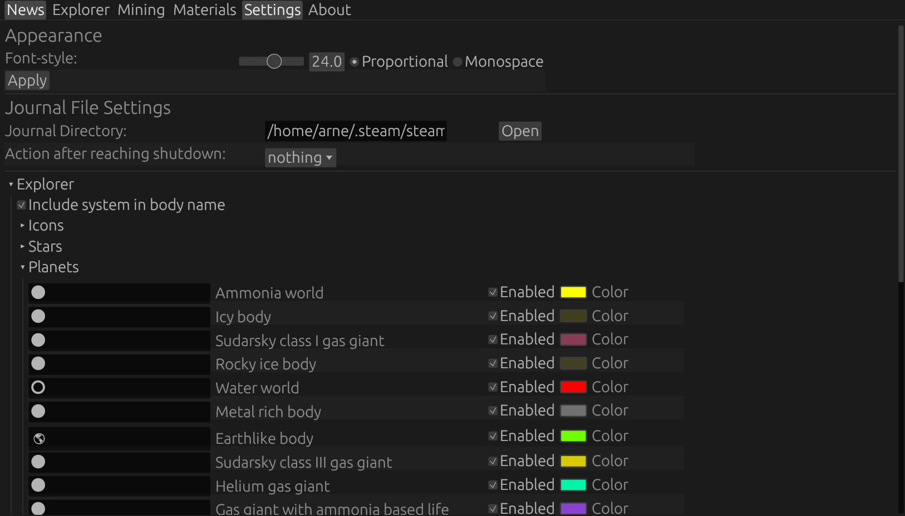

# Elite Dangerous Commander Assistant System

Shows system information compact for explorer.

<h2>Gotta see all those planets!</h2>


<h2>Track your materials!</h2>


<h2>Make it truly yours!</h2>



<h2>And much more!</h2>

## Features

* System and its data represented in a compact view
* List signals found in system to find Raxxla ASAP
* Get help mining by showing relevant data
* Keep track of your materials
* Apply graphic override configurations (with presets or your own!)
* Always keep track of what the feds are doing in the news tab
* Written in rust so you know its good

## Installation

### Debian Based

Simply download the .deb file from the <a href="https://github.com/arne-fuchs/edcas-client/releases">release</a> tab and installit via dpkg:

```bash
sudo dpkg -i edcas-client.deb
```

### Arch

#### Aur:

```
paru -S edcas-client-bin
```
#### makepkg:

Download the PKGBUILD file.

In the same folder run:
```
makepkg -i
```

## Command Options

| Option       | Description                                     | Example            |
|--------------|-------------------------------------------------|--------------------|
| --version    | Prints version into terminal                    |                    |
| --width      | Sets initial window width size for the gui      | --width 200.0      |
| --height     | Sets initial window height size for the gui     | --width 800.0      |
| --wposition  | Sets initial window width position for the gui  | --wposition 3000.0 |
| --hposition  | Sets initial window height position for the gui | --hposition 100.0  |
| --fullscreen | Opens the gui in fullscreen                     |                    |
| --maximized  | Opens the guis maximized                        |                    |


# Build it yourself

## Build Requirements

* Around 10 GB of disk space required
* <a href=https://www.rust-lang.org/tools/install >Rust with cargo</a>

### Debian based

```bash
sudo apt install cmake cargo pkg-config libssl-dev libasound2-dev libfontconfig1-dev libclang-dev openssl clang build-essential git libudev-dev
```
### Arch

```bash 
cargo alsa-lib fontconfig clang rocksdb
sudo pacman -S cargo alsa-lib fontconfig git
```
## Building

Clone the repo

```bash
git clone https://github.com/arne-fuchs/edcas-client.git
```

cd into it and build it

```bash
cd edcas-client && cargo build
```

## Standard directories

Edcas will first look into some standard directories before falling back into the current directory.
It might try to copy the files to the desired places.

| File                       | Look-up                                  | Fallback                |
|----------------------------|------------------------------------------|-------------------------|
| settings-example.json      | /etc/edcas-client/settigns-example.json  | ./settings-example.json |
| settings.json              | $HOME/.config/edcas-client/settings.json | ./settings.json         |
| Assets like materials.json | /usr/share/edcas-client/                 | ./                      |
| logs                       | /tmp/edcas-client/                       | ./logs/                 |


## Using it with <a href=https://github.com/rfvgyhn/min-ed-launcher>min-ed-launcher</a>

Go and first build the project with
```bash
cargo build
```

Then edit your min-ed-launcher config:

```bash
nano ~/.config/min-ed-launcher/settings.json
```

and add this to your processes:

```json
"processes": [
        {
          "fileName": "/PATHTOPROJECT/edcas-client/start.sh",
          "arguments": ""
        }
    ],
```

If you installed edcas-client over a package, you can find the binary in /usr/bin/edcas-client.

## Suggestions, Ideas & Bug Reports
Feel free to contact me for feature requests on Discord: frank_the_fish or use the issue feature.

For bugs, you can use the issue feature on GitHub.
