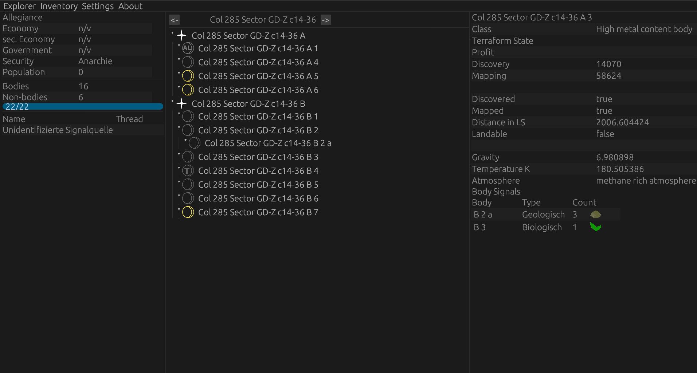

# EDCAS
### Elite Dangerous Commander Assistant System

Shows system information compact for explorer.


(Language depends on in-game setting)

## Features

* System represented in a system tree
* Est. profit calculation per planet
* Recognize tarraformable Planets, water worlds and earth-like worlds fast to maximize your exploration profit
* See body signals fast and sorted by size to get those plant's data!
* List signals found in system to find Raxxla ASAP.
* Be able to iterate back to look at past systems of your session to see if you missed something
* Written in rust so you know its good

## Notice

```
Currently only tested on Linux!!!
Looking for Windows tester!
```

## Build Requirements

```bash
sudo apt install cmake cargo pkg-config libasound2-dev libfontconfig1-dev libclang-dev libzmq3-dev git
```

<a href=https://www.rust-lang.org/tools/install >Rust with cargo</a>

## Building

Clone the repo

```bash
clone git https://github.com/arne-fuchs/edcas-client.git
```

cd into it and build it

```bash
cd edcas-client && cargo build
```

## Configure

Copy the config

```bash
cp settings-example.json settings.json
```

Edit the settings.json

```bash
nano settings.json
```

Go to journal-directory and paste in the absolute path to the journal directory of Elite.

In Linux, it would be something like
```/home/YOURUSERHERE/.steam/steam/steamapps/compatdata/359320/pfx/drive_c/users/steamuser/Saved Games/Frontier Developments/Elite Dangerous```

And on Windows
```C:\\users\\YOURUSERHERE\\Saved Games\\Frontier Developments\\Elite Dangerous```

## Using it with <a href=https://github.com/rfvgyhn/min-ed-launcher>min-ed-launcher</a>

Go and first build the project with
```bash
cargo build
```

Then edit your min-ed-launcher config:

```bash
nano ~/.config/min-ed-launcher/settings.json
```

and add this to your processes:

```json
"processes": [
        {
          "fileName": "/PATHTOPROJECT/edcas-client/start.sh",
          "arguments": ""
        }
    ],
```

## Planned Features

### Accounts [In progress]
Accounts on based on the <a href=https://www.iota.org/ >IOTA Protocol<a/>
### News page
### Inventory & Material management
Idea: Showing Inventory cargo prices with history and galactic average and highest price.
Material should have colors where green is full, red is empty and yellow-ish is in between.
### Material Tracker
Idea: Pick a modification and the tool tracks the missing materials and list them for you.
Best case would be a description where you can get them
### (EDDN Adapter)


## Suggestions, Ideas & Bug Reports
Feel free to contact me for feature requests on Discord: Frank_The_Fish#3375 or use the issue feature.

For bugs, you can use the issue feature on GitHub.