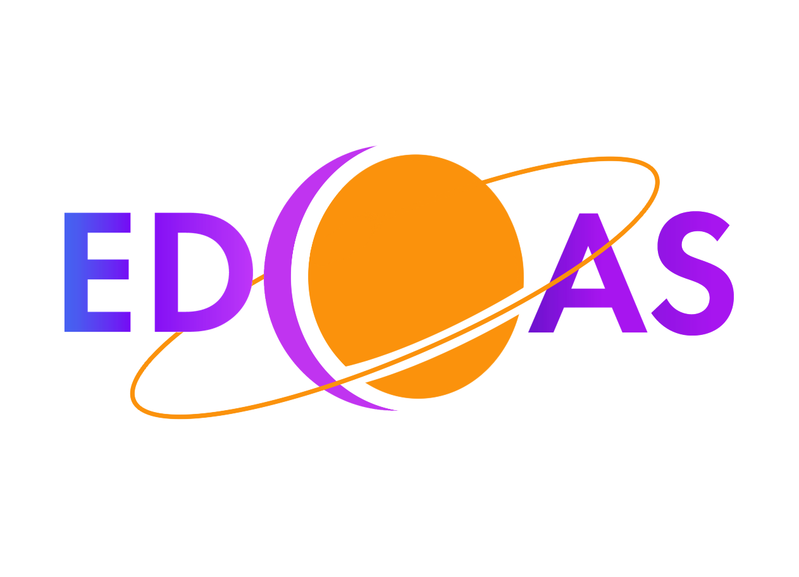
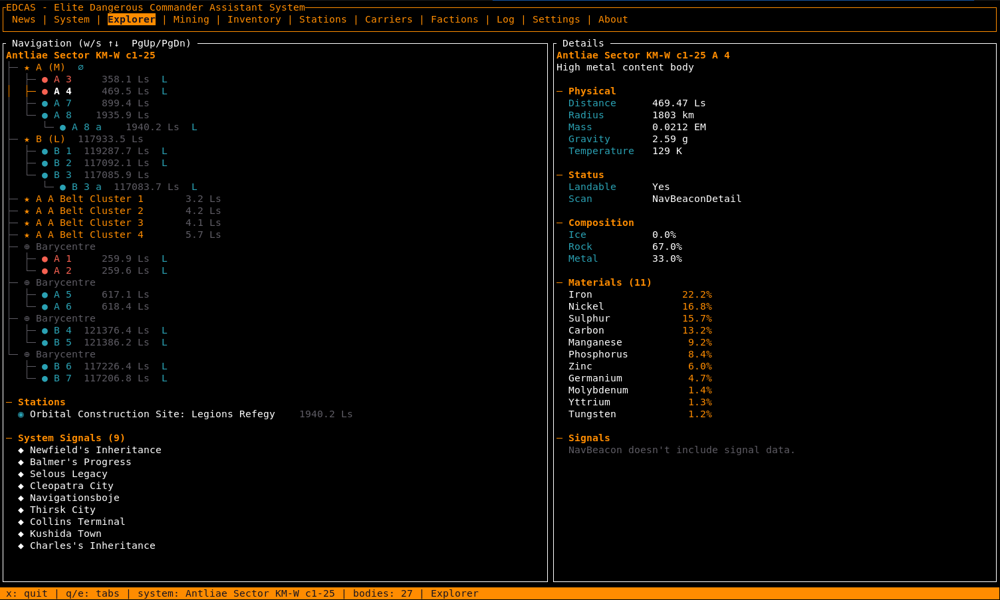
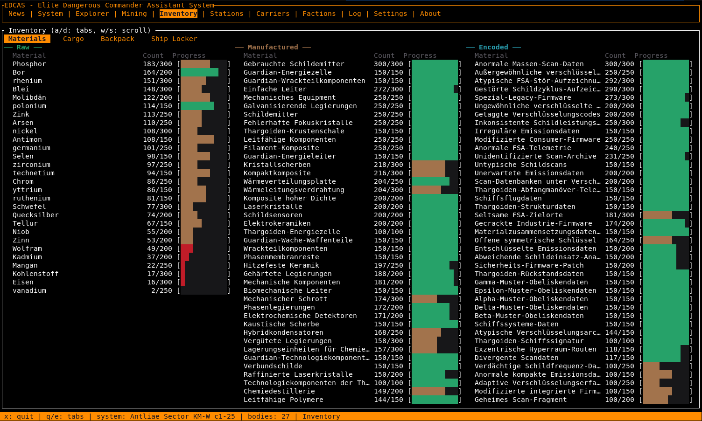

# Elite Dangerous Commander Assistant System

Shows system information compact for explorer.

<h2>Gotta see all those planets!</h2>



<h2>Track your materials!</h2>



<h2>And much more!</h2>

## Features

edcas is a fast terminal UI (TUI) that reads your Elite Dangerous journal logs live and
organises everything into tabbed views.

**Exploration**
* System and its bodies represented in a compact, scannable view
* Body details: type, terraforming state, estimated scan/mapping value, gravity, atmosphere, materials
* Lists the signals found in a system so you can find Raxxla ASAP
* Mining tab that surfaces the data that actually helps you mine

**Commander & ship**
* Commander overview — ranks, reputation, credits and powerplay
* Ship, modules and on-foot suit loadout at a glance
* Engineering workshop — track materials, modules and blueprint progress

**Galaxy & trade (powered by the edcas server / EDDN)**
* Station and fleet-carrier search with live market, outfitting and shipyard data
* Faction / background-simulation (BGS) search
* Trade-route and trade-loop finder
* "Nearest commodity" search for buying/selling runs
* Construction-depot (colonisation) tracking for the constructions you'll never finish
* GalNet news tab to keep track of what the feds are doing

**Data sharing**
* Contributes back to the community: uploads sanitised data to the [EDDN](https://github.com/EDCD/EDDN)
  network (like EDMC / EDDiscovery) and, optionally, to the edcas API — each is an
  independent opt-in/opt-out toggle (see [Data uploads](#data-uploads-eddn--edcas-api))

**Quality of life**
* Background journal file watcher — the UI updates live as you play
* Pin entries and keep a personal todo list
* Runs natively on Linux & Windows, or in the browser via WebAssembly
* Self-hostable server (EDDN ingest + REST API) — or just use the public instance
* Written in rust so you know its good
* All open source

---

## Running the client

### Install a pre-built package

**Debian / Ubuntu**

Download the `.deb` from the [releases](https://github.com/arne-fuchs/edcas-client/releases) page and install:

```bash
sudo dpkg -i edcas-client.deb
```

**Arch Linux (AUR)**

```bash
paru -S edcas-client-bin
```

Or with `makepkg` — download the `PKGBUILD` and run:

```bash
makepkg -i
```

### Build from source

**Requirements**

* Rust (stable) — [install](https://www.rust-lang.org/tools/install)
* ~10 GB disk space for the build cache

**System dependencies (Debian / Ubuntu)**

```bash
sudo apt install cmake pkg-config build-essential git \
    libwayland-dev libglib2.0-dev libgdk3.0-cil-dev \
    libappindicator3-dev libsoup-3.0-dev libwebkit2gtk-4.1-dev libxdo-dev
```

**Build and run**

```bash
git clone https://github.com/arne-fuchs/edcas-client
cd edcas-client
cargo run --release
```

### Run in the browser (WebAssembly)

The client can also be compiled to WebAssembly and served as a static web page using [xterm.js](https://xtermjs.org/) as the terminal emulator. File I/O and journal reading are disabled; the search tabs (Stations, Carriers, Factions, Construction) work via async HTTP.

**Requirements**

* `wasm-pack` — `cargo install wasm-pack`
* Any static file server (e.g. Python's built-in one)

**Build**

```bash
./web/build.sh
# equivalent: wasm-pack build --target web --out-dir web/pkg
```

**Serve**

```bash
cd web
python3 -m http.server 8080
# open http://localhost:8080
```

Settings and pinned entries are stored in `localStorage` and survive page reloads.

### Configuration files

| File | Default location | Fallback |
|---|---|---|
| `settings.json` | `$HOME/.config/edcas-client/settings.json` | `./settings.json` |
| Assets (`materials.json`, …) | `/usr/share/edcas-client/` | `./` |

### Launch alongside the game (min-ed-launcher)

Add to your [min-ed-launcher](https://github.com/rfvgyhn/min-ed-launcher) config at `~/.config/min-ed-launcher/settings.json`:

```json
"processes": [
    {
        "fileName": "/usr/bin/edcas-client",
        "arguments": ""
    }
]
```

---

## Data uploads (EDDN & edcas API)

As you play, edcas can share data with two destinations. Both are **on by default** and
each can be turned off independently in the **Settings** tab.

| Setting | Default | Description |
|---|---|---|
| `edcas_api_enabled` | `true` | Upload journal events to the edcas API (`api_url`) for the search/trade features |
| `eddn_enabled` | `true` | Upload to the public [EDDN](https://github.com/EDCD/EDDN) network |
| `eddn_url` | `https://eddn.edcd.io:4430/upload/` | EDDN upload gateway |
| `eddn_test_mode` | `true` | Send to EDDN's **test** pipeline (validated but not relayed) |

### What gets sent to EDDN

Like EDMC and EDDiscovery, edcas converts a curated, **sanitised** subset of your journal
into the public EDDN schemas: `journal/1` (Docked, FSDJump, Scan, Location, SAASignalsFound,
CarrierJump) plus `commodity/3`, `outfitting/2` and `shipyard/2` from the game's
`Market.json` / `Outfitting.json` / `Shipyard.json`. All `_Localised` strings and
Cmdr-specific fields are stripped before sending, per the EDDN rules.

### Going live

There is **no registration** for EDDN — you just start uploading. edcas identifies itself
with the `softwareName` `EDCAS` and its crate version, and will automatically appear in the
EDDN stats at <https://eddn.edcd.io/>.

The client ships in **test mode** so the first real-world data goes to EDDN's test pipeline.
Once you've confirmed uploads succeed (look for `HTTP 200 OK` in the log; a `400`/`426`
indicates a schema problem), turn off **EDDN Test Mode** in the Settings tab to contribute
to the live network. If you ever need beta/dev endpoints, ask in the `#eddn` channel of the
[EDCD Discord](https://edcd.github.io/).

---

## Running the server

The server (`edcas-server`) listens to the [Elite Dangerous Data Network (EDDN)](https://github.com/EDCD/EDDN) ZeroMQ stream, ingests it into PostgreSQL, and exposes a REST API that the client queries for search results.

You only need to run the server yourself if you want to host your own instance. The public instance at `https://edcas.de` is used by default.

### Requirements

* PostgreSQL 14+
* `libzmq` (ZeroMQ 4.x)

**Debian / Ubuntu**

```bash
sudo apt install libzmq3-dev pkg-config
```

### Option A — Docker Compose (recommended)

This is the easiest way. From the repository root:

```bash
docker compose up --build
```

This starts PostgreSQL and `edcas-server` together. The API is available at `http://localhost:3000`.

Data is persisted in `../edcas-data/postgres-data` relative to the repository root.

### Option B — Run manually

**1. Create the database**

```bash
createdb edcas
```

That's it — `edcas-server` **applies the schema and any pending migrations automatically on
startup** (tracked in a `schema_migrations` table), so you don't need to run `psql -f`
manually. On an existing database it only creates what's missing.

**2. Set environment variables**

| Variable | Default | Description |
|---|---|---|
| `DB_HOST` | `localhost` | PostgreSQL host |
| `DB_PORT` | `5432` | PostgreSQL port |
| `DB_USER` | *(required)* | PostgreSQL user |
| `DB_PASSWORD` | *(required)* | PostgreSQL password |
| `DB_NAME` | `edcas` | PostgreSQL database |
| `API_PORT` | `3000` | Port for the REST API |
| `EDDN_URL` | `tcp://eddn.edcd.io:9500` | EDDN ZeroMQ endpoint |
| `RUST_LOG` | — | Log filter, e.g. `edcas_server=info` |

**3. Build and run**

```bash
export DB_USER=edcas
export DB_PASSWORD=edcas

cargo run --release --bin edcas-server
```

### Database migrations

The server runs migrations automatically on startup, tracked in a `schema_migrations`
table so each is applied exactly once. The migration set is embedded into the binary, so
deploying a new build is all that's needed to bring a database up to date — no manual SQL.

- `crates/edcas-server/schema.sql` is migration `0001` (the full canonical schema). It uses
  `CREATE … IF NOT EXISTS`, so it also adopts a pre-existing database by creating only the
  objects that are missing.
- To add a change, drop `crates/edcas-server/migrations/NNNN_name.sql` and append a
  `(version, include_str!("../migrations/NNNN_name.sql"))` entry to the list in
  `crates/edcas-server/src/migrations.rs`. **Never edit or reorder existing entries** — they
  may already be recorded as applied in production.

### Pointing the client at your own server

In the client, go to the **Settings** tab → set the API URL to your server address, e.g.:

```
http://localhost:3000
```

### API endpoints

| Method | Path | Description |
|---|---|---|
| `GET` | `/api/v1/systems/:address` | Star system metadata |
| `GET` | `/api/v1/systems/:address/bodies` | All bodies in a system |
| `GET` | `/api/v1/system-population-history?system_address=&days=` | Population history for a system |
| `GET` | `/api/v1/stations?name=&system_name=&market_id=&limit=` | Station search |
| `GET` | `/api/v1/commodity-price-history?market_id=&commodity=&days=` | Commodity price history |
| `GET` | `/api/v1/carriers?name=&callsign=&system_name=&market_id=&limit=` | Fleet carrier search |
| `GET` | `/api/v1/factions?name=&limit=` | Faction search |
| `GET` | `/api/v1/faction-influence-history?name=&system_address=&days=` | Faction (BGS) influence history |
| `GET` | `/api/v1/construction-depots?name=&system_name=&market_id=&limit=` | Construction depot search |
| `POST` | `/api/v1/construction-depots` | Submit construction depot data |
| `GET` | `/api/v1/trade-routes` | Best one-way trade routes |
| `GET` | `/api/v1/trade-loops` | Round-trip trade loops |
| `GET` | `/api/v1/nearest-commodity?commodity=&reference_system=&limit=` | Nearest market for a commodity |
| `POST` | `/api/v1/nearest-multi-commodity` | Nearest market for several commodities |
| `GET` | `/api/v1/server-tick` | Predicted BGS server tick |
| `POST` | `/api/v1/journal/event` | Upload a single journal event |
| `POST` | `/api/v1/journal/events` | Upload a batch of journal events |

All responses are JSON.

---

## Suggestions, Ideas & Bug Reports

Feel free to contact me for feature requests on Discord: `frank_the_fish` or use the issue tracker.

For bugs, please use the [GitHub issues](https://github.com/arne-fuchs/edcas-client/issues) page.
